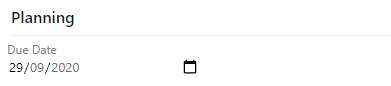
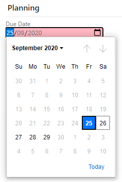
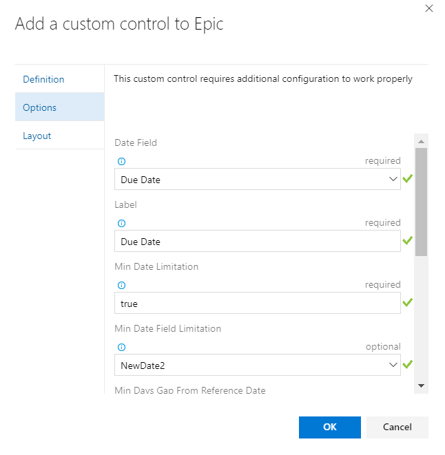
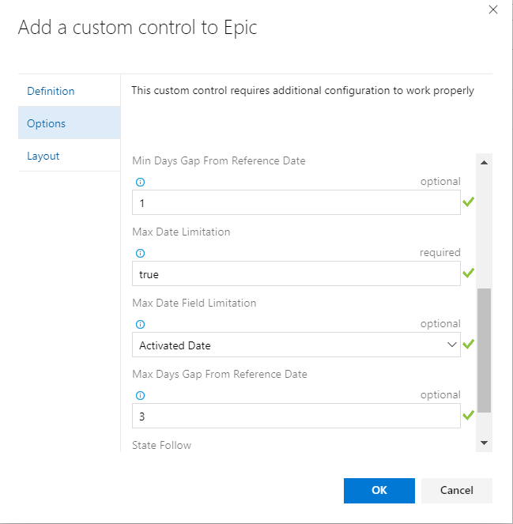
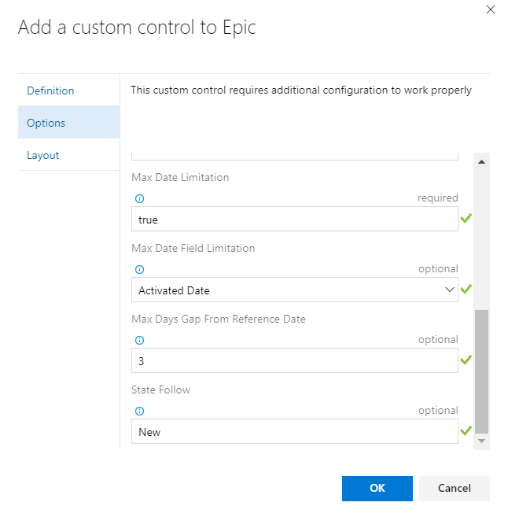

Rich Date Control...

# view short date

First this control give you a short date view.

# deffine limitation for the values

The second ventage, it give you the option to limit the date that can be pick
by give him two more date fields that contain the max or min date.
and with the max day or min days you can fine tune the date days gap from the selected date (default is current date)

for example :
you can set two date fields in your form, one represent the open date
and the second represent the dou date, and to set it a limit of 7 days max (or min) from the open date.

# Nothis if the date passed

you can have a red sign if the date passed

# Install and Configure

Configuration:

* Date Field                       : (work item field) that will contain the date (short date)
* Label                            : (text) The label of the field
* Min Date Limitation              : (true/false) optional, if you want to set future date limitation (default reference is today date)
* Min Date Field Limitation        : (work item field) optional, if you want to set the future limitation reference to other date field
* Min Days Gap From Reference Date : (number even negativ) optional, you can set a number of day to gap from the reference future date
* Max Date Limitation              : (true/false) optional, if you want to set Past date limitation (default reference is today date)
* Max Date Field Limitation        : (work item field) optional, if you want to set the past limitation reference to other date field
* Max Days Gap From Reference Date : (number even negativ) optional, you can set a number of day to gap from the reference past date
* State Follow                     : (string) optional, you can set the state of this time represent, so it will show signal when the time passed and the state still

Installation:

